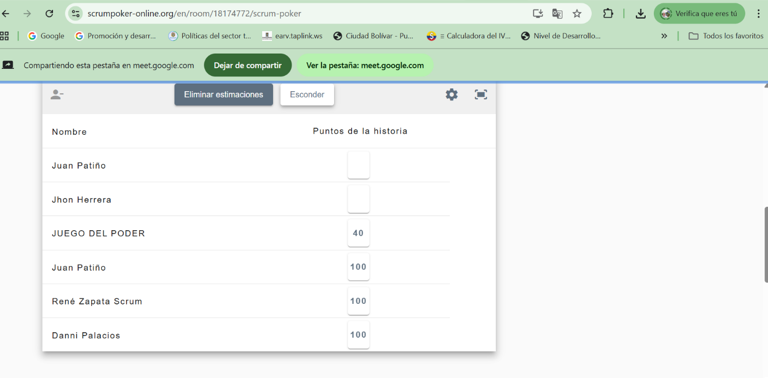
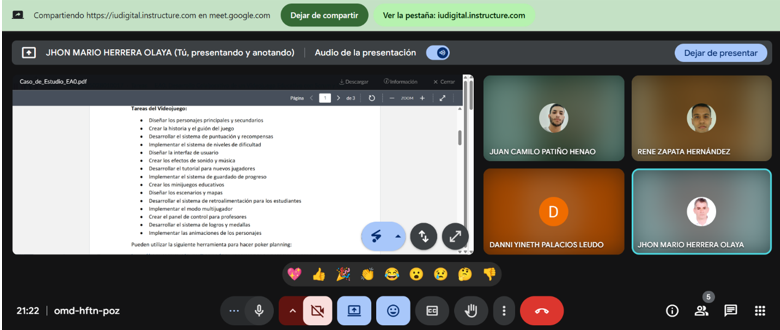

## Introducción

"parte a desarrollar por Jhon Herrera"

---

## Definición del Sprint: Explicación de la duración del sprint con su justificación.

# Tareas - Tiempo - Justificacion #

Diseñar los personajes principales y secundarios: 4 Dias : Leyendo la historia se sacarian los personajes y se harian las propuesdas de diseño, teniendo dibjados cuatro prpuestas y ssucaracteristicas de los personajes

Crear la historia y el guión del juego: 8 Dias: Se hace un documento donde se cuenta la historias de como el el juego de desiframiento de frases y operaciones del ejercito contrario, donde se mostraran personajes de diferentes niveles, lo stiempos y como se analizo la frace a descifrar.

Desarrollar el sistema de puntuación y recompensas: 2 Dias: De hace un sitema de puntuacion desarrollado en base al tiempo de respuesta y los territorios ocupados del maña a medida que se decrifran fraces

Implementar el sistema de niveles de dificultad: 4 Dias: Si pensaria los diferentes niveles y se pensaria los objetivos de cada nivel y que se busca, despue se harina los analisis y por ultimos las correciones a cada nivel en cuanto objetivo y diseño.

Diseñar la interfaz de usuario: 15 Dias: Demoraria el doble de tiempo debido a escojer las diferentes interfaces mas la carga de un mapa de prueba con objeivos a partir del cual se desarrollaran los demas, mas las pruebas de trabajos de la intefaz

Crear los efectos de sonido y música: 5 Dias: Se escojerias los diferentes sonidos y se integraria a la interfaz de usario

Desarrollar el tutorial para nuevos jugadores: 3 Dias: ya despues de elaborado el proyecto se indicaria como usarlo

Implementar el sistema de guardado de progreso: 3 Dias: Se estableceria el formato y variables que se necesitarias para evaluar el progreso por jugador y en que se va a guardar

Crear los minijuegos educativos: 3 Dias: 1 dia para hacerlos junto con el tutoria y que pasara en cada nivel y dos corriguendo y aceptando subgerencias

Diseñar los escenarios y mapas: 30 Dias: Se hacer los maspas y se integraria al mapa

Desarrollar el sistema de retroalimentación para los estudiantes: 5 Dias: Se haria un herramienta que permita analizar los archivos guardados y los datos a enviar a un abase de datos para nalizar resultado

Implementar el modo multijugador: 0 Dias: No aplica
Crear el panel de control para profesores: 15 Dias: ya que dependeria de los datos enviasdo por cada jugador y le le peritira analisis y hacer estaditicas de todlos gugadore so por grupos.

Desarrollar el sistema de logros y medallas: 5 Dias: ya que se diseña una recompensa incial, mas bonos estras segun el mapa y el diseño del juego.

Implementar las animaciones de los personajes: 30 Dias: Ya que dependiendo de la cantidad de personaje sse haria una animacion basica mas los fondos y tambien se debe decidir de cuantas dimenciones se haran los personajes.

---
## Estimación de Tareas: Tabla con las tareas y sus puntuaciones asignadas mediante Poker Planning.

---

## Lista de Prioridades: Orden de las tareas según su prioridad.

---

## Desarrollo Colaborativo con Git: Explicación del proceso seguido en GitHub, incluyendo la creación de ramas y merge requests

Para el desarrollo de este proyecto utilizamos **GitHub** como plataforma central de control de versiones y colaboración en equipo.

**Creación del repositorio:** uno de los integrantes del equipo (René) fue el encargado de crear el repositorio en GitHub y configurar los accesos de los demás miembros.

**Uso de ramas:** cada integrante creó su propia rama de trabajo a partir de la rama principal (main). De esta manera, se evitaban conflictos al momento de trabajar en paralelo y cada quien podía subir sus avances sin afectar el trabajo de los demás.

**Subida de cambios:** cada integrante subió sus aportes directamente a su rama, manteniendo un historial de commits que reflejaba las modificaciones realizadas.

**Merge requests (pull requests):** una vez finalizada la parte de cada integrante, se realizó el proceso de merge para integrar las ramas con la rama principal. Antes de hacer el merge se revisaban los cambios para asegurar coherencia en el proyecto y evitar errores.

**Colaboración y control:** este proceso permitió trabajar de forma organizada, identificar rápidamente quién realizó cada aporte y resolver conflictos en caso de cambios simultáneos.

En conclusión, GitHub nos permitió desarrollar el proyecto de manera colaborativa, garantizando orden, trazabilidad de los cambios y facilidad para unir los aportes individuales en un trabajo final unificado.

---

## Documento Game Design: Desarrollo del contenido requerido en el archivo "game-design.txt".

Su equipo ha sido contratado para desarrollar un videojuego educativo para niños de
primaria. Utilizarán Scrum para gestionar el proyecto.

1. Planificación de videojuego educativo.
Primero, definan la duración de su sprint (1, 2 o más semanas según consideren
apropiado). Recuerden que esta duración no representa el tiempo total del proyecto,
sino cada iteración de trabajo.
Realizar un poker planning para asignar puntos a cada una de las siguientes tareas.
Definan su propia escala de puntuación y lleguen a un consenso en equipo.

Tareas del Videojuego:

• Diseñar los personajes principales y secundarios

• Crear la historia y el guión del juego

• Desarrollar el sistema de puntuación y recompensas

• Implementar el sistema de niveles de dificultad

• Diseñar la interfaz de usuario

• Crear los efectos de sonido y música

• Desarrollar el tutorial para nuevos jugadores

• Implementar el sistema de guardado de progreso

• Crear los minijuegos educativos

• Diseñar los escenarios y mapas

• Desarrollar el sistema de retroalimentación para los estudiantes

• Implementar el modo multijugador

• Crear el panel de control para profesores

• Desarrollar el sistema de logros y medallas

• Implementar las animaciones de los personajes

Pueden utilizar la siguiente herramienta para hacer poker planning:
https://www.scrumpoker-online.org/

2. Priorización de tareas
Ordenar las tareas de acuerdo a su prioridad (primero las más prioritarias, y por último
las menos prioritarias). Para hacer esto, pueden ayudarse con un gráfico de estimación
similar a este (recuerden que normalmente este tipo de gráficos es para tareas de deuda
técnica):

Figura 1. Gráfico de estimación.

---

Fuente. Construcción propia creado en www.miro.com
3. Desarrollo Colaborativo con Git
El delegado del equipo creará un repositorio llamado "videojuego-educativo" y
dentro creará un archivo "game-design.txt" con el siguiente contenido:

[NOMBRE DEL JUEGO] es un videojuego educativo diseñado para enseñar [MATERIA]
a estudiantes de primaria a través de una experiencia inmersiva y muy emocionante.
La historia se desarrolla en [ESCENARIO], un mundo lleno de misterios, desafíos y
personajes fascinantes que guiarán a los jugadores en su aprendizaje. Cada nivel del
juego está diseñado para combinar diversión y educación, permitiendo que los
estudiantes adquieran conocimientos de manera natural mientras exploran,
resuelven problemas y superan obstáculos.

El protagonista de esta aventura es [NOMBRE], un/a [DESCRIPCIÓN FÍSICA Y DE
PERSONALIDAD]. [NOMBRE] es un/a [ROL] que ha sido elegido/a para una misión
única: [OBJETIVO PRINCIPAL]. Con su [CARACTERÍSTICA ESPECIAL], [NOMBRE]
deberá enfrentarse a desafíos cada vez más complejos mientras aprende y enseña a
los jugadores conceptos clave de [MATERIA].

El jugador podrá [MECÁNICA 1], para avanzar deberá [MECÁNICA 2] y los desafíos
incluirán [TIPO DE DESAFÍOS]

Los estudiantes avanzarán mediante [SISTEMA]. Cada nivel representa [CONCEPTO
EDUCATIVO], y los jugadores recibirán retroalimentación inmediata sobre su
desempeño, lo que les permitirá identificar áreas de mejora y celebrar sus logros.

Los jugadores aprenderán [CONCEPTO 1] mediante [ACTIVIDAD 1]. Se reforzará
[CONCEPTO 2] a través de [ACTIVIDAD 2] y las evaluaciones se realizarán mediante
[MÉTODO], lo que permitirá a los profesores y estudiantes medir el progreso de
manera efectiva.

El juego se desarrollará usando [TECNOLOGÍA] y tendrá soporte para
[PLATAFORMAS]. Además, se implementarán características como
[CARACTERÍSTICAS TÉCNICAS ADICIONALES] para garantizar una experiencia de
juego fluida y atractiva.

"parte a desarrollar por jhon herrera

-----
## Conclusiones: Reflexión sobre la actividad y el trabajo en equipo.
GitHub transforma el desarrollo de software de una tarea individual a un proceso colectivo y transparente. 
Su modelo de control de versiones distribuido con Git permite a los colaboradores trabajar en sus propias copias del proyecto,
fusionando los cambios de forma segura y controlada. Esto evita conflictos y pérdidas de información, un problema común en métodos de colaboración más antiguos.

---
## Referencias: Fuentes consultadas (si aplica).

	-)CHRISTOPHER W. H. DAVIS, 2015, Agile Metrics in Action How to measure and improve team performance, Manning Publications Co. 270 Paginas, ISBN: 9781617292484
 
	-)Project Management Institute, Inc., editor. 2017, La guía de los fundamentos para la dirección de proyectos (Guía del PMBOK), Project Management Institute, Inc., 762 paginas, ISBN: 978-1-62825-194-4

