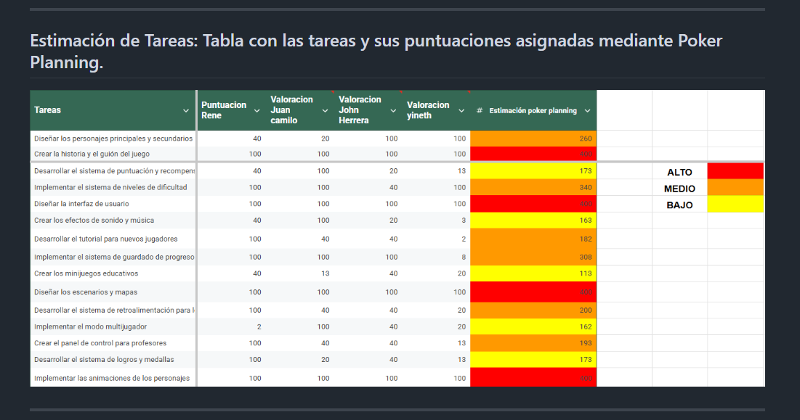
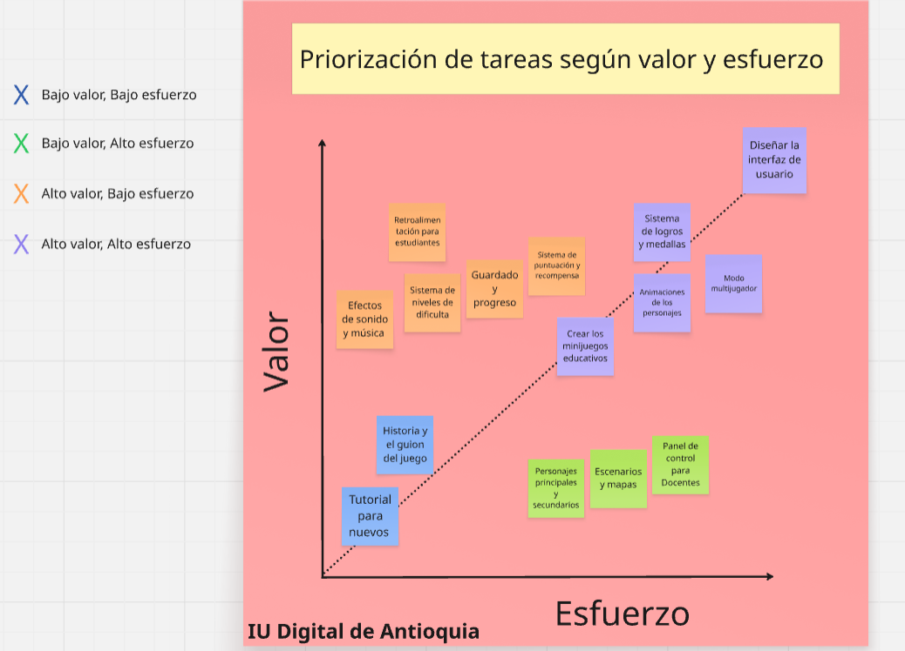

## Introducción

"parte a desarrollar por Jhon Herrera"

---

## Definición del Sprint: Explicación de la duración del sprint con su justificación.

"parte a desarrollar por Rhene"

---
## Estimación de Tareas: Tabla con las tareas y sus puntuaciones asignadas mediante Poker Planning.

---

## Lista de Prioridades: Orden de las tareas según su prioridad.

"parte a desarrollar por yineth"

---

## Desarrollo Colaborativo con Git: Explicación del proceso seguido en GitHub, incluyendo la creación de ramas y merge requests

"parte a desarrollar por Juan Camilo "

---

## Documento Game Design: Desarrollo del contenido requerido en el archivo "game-design.txt".

Su equipo ha sido contratado para desarrollar un videojuego educativo para niños de
primaria. Utilizarán Scrum para gestionar el proyecto.

1. Planificación de videojuego educativo.
Primero, definan la duración de su sprint (1, 2 o más semanas según consideren
apropiado). Recuerden que esta duración no representa el tiempo total del proyecto,
sino cada iteración de trabajo.
Realizar un poker planning para asignar puntos a cada una de las siguientes tareas.
Definan su propia escala de puntuación y lleguen a un consenso en equipo.

Tareas del Videojuego:

• Diseñar los personajes principales y secundarios

• Crear la historia y el guión del juego

• Desarrollar el sistema de puntuación y recompensas

• Implementar el sistema de niveles de dificultad

• Diseñar la interfaz de usuario

• Crear los efectos de sonido y música

• Desarrollar el tutorial para nuevos jugadores

• Implementar el sistema de guardado de progreso

• Crear los minijuegos educativos

• Diseñar los escenarios y mapas

• Desarrollar el sistema de retroalimentación para los estudiantes

• Implementar el modo multijugador

• Crear el panel de control para profesores

• Desarrollar el sistema de logros y medallas

• Implementar las animaciones de los personajes

Pueden utilizar la siguiente herramienta para hacer poker planning:
https://www.scrumpoker-online.org/

2. Priorización de tareas
Ordenar las tareas de acuerdo a su prioridad (primero las más prioritarias, y por último
las menos prioritarias). Para hacer esto, pueden ayudarse con un gráfico de estimación
similar a este (recuerden que normalmente este tipo de gráficos es para tareas de deuda
técnica):

Figura 1. Gráfico de estimación.

---

Fuente. Construcción propia creado en www.miro.com
3. Desarrollo Colaborativo con Git
El delegado del equipo creará un repositorio llamado "videojuego-educativo" y
dentro creará un archivo "game-design.txt" con el siguiente contenido:

[NOMBRE DEL JUEGO] es un videojuego educativo diseñado para enseñar [MATERIA]
a estudiantes de primaria a través de una experiencia inmersiva y muy emocionante.
La historia se desarrolla en [ESCENARIO], un mundo lleno de misterios, desafíos y
personajes fascinantes que guiarán a los jugadores en su aprendizaje. Cada nivel del
juego está diseñado para combinar diversión y educación, permitiendo que los
estudiantes adquieran conocimientos de manera natural mientras exploran,
resuelven problemas y superan obstáculos.

El protagonista de esta aventura es [NOMBRE], un/a [DESCRIPCIÓN FÍSICA Y DE
PERSONALIDAD]. [NOMBRE] es un/a [ROL] que ha sido elegido/a para una misión
única: [OBJETIVO PRINCIPAL]. Con su [CARACTERÍSTICA ESPECIAL], [NOMBRE]
deberá enfrentarse a desafíos cada vez más complejos mientras aprende y enseña a
los jugadores conceptos clave de [MATERIA].

El jugador podrá [MECÁNICA 1], para avanzar deberá [MECÁNICA 2] y los desafíos
incluirán [TIPO DE DESAFÍOS]

Los estudiantes avanzarán mediante [SISTEMA]. Cada nivel representa [CONCEPTO
EDUCATIVO], y los jugadores recibirán retroalimentación inmediata sobre su
desempeño, lo que les permitirá identificar áreas de mejora y celebrar sus logros.

Los jugadores aprenderán [CONCEPTO 1] mediante [ACTIVIDAD 1]. Se reforzará
[CONCEPTO 2] a través de [ACTIVIDAD 2] y las evaluaciones se realizarán mediante
[MÉTODO], lo que permitirá a los profesores y estudiantes medir el progreso de
manera efectiva.

El juego se desarrollará usando [TECNOLOGÍA] y tendrá soporte para
[PLATAFORMAS]. Además, se implementarán características como
[CARACTERÍSTICAS TÉCNICAS ADICIONALES] para garantizar una experiencia de
juego fluida y atractiva.

"parte a desarrollar por jhon herrera

-----
## Conclusiones: Reflexión sobre la actividad y el trabajo en equipo.
"parte a desarrollar por yineth"

---
## Referencias: Fuentes consultadas (si aplica).
